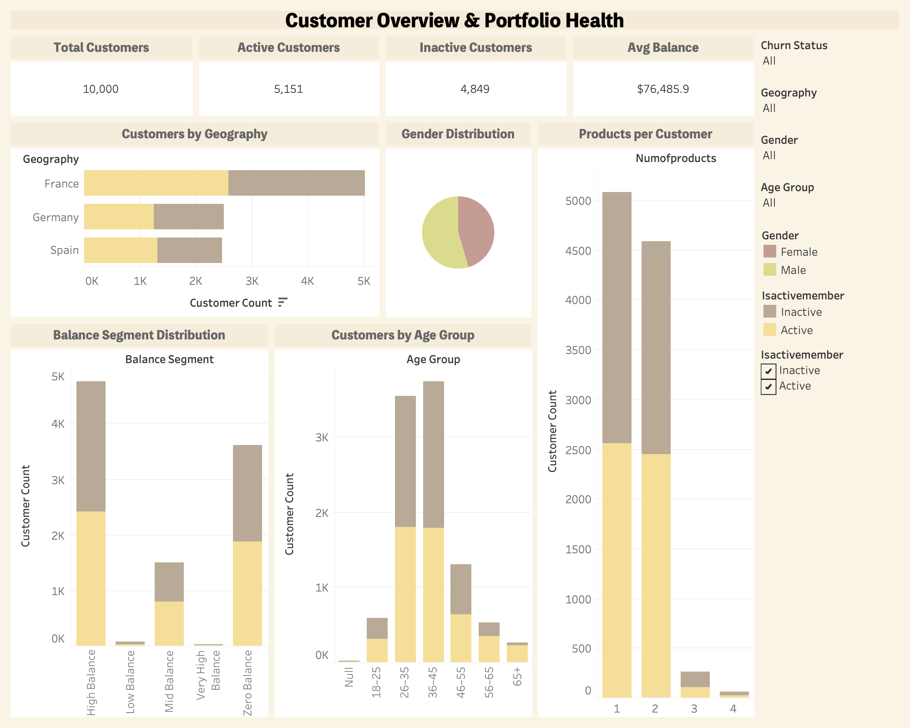

# 📊 Customer Churn Segmentation & Analysis

## 📌 Project Overview

Customer churn is a critical challenge for the banking industry, directly impacting revenue and long-term growth.
This project focuses on analysing bank customer data to identify **churn drivers**, **behavioural patterns**, and **high-risk customer segments** using a combination of **Python-based data preparation** and **Tableau dashboards**.

The outcome is a set of **business-ready dashboards** that support data-driven retention strategies.

---

## 🎯 Business Objectives

* Analyse customer churn behaviour
* Identify high-risk churn segments
* Understand churn drivers across demographics and engagement
* Enable actionable insights for customer retention

---

## 🧰 Tools & Technologies

* **Python** (Pandas, NumPy) – Data Cleaning & Feature Engineering
* **VS Code** – Development Environment
* **Tableau** – Interactive Dashboards & Visual Analytics

---

## 📁 Project Structure

```
customer-churn-segmentation/
│
├── dashboards/
│   ├── Book1.twbx
│   ├── dashboard_1.png
│   └── dashboard_2.png
│
├── data/
│   ├── processed/
│   │   └── bank_customer_churn_cleaned.csv
│   └── raw/
│       └── bank_customer_churn.csv
│
├── notebook/
│   └── data_cleaning.ipynb
│
├── .gitignore
└── README.md
```

---

## 🧹 Data Cleaning & Preparation

All data preprocessing is handled in **`notebook/data_cleaning.ipynb`**.

Key steps include:

* Removal of non-analytical identifiers
* Feature engineering:

  * Age Groups
  * Balance Segments
  * Activity Status
  * Churn Labels
* Data type validation and consistency checks

The cleaned dataset is exported to `data/processed/` and used directly in Tableau.

---

## 📊 Dashboard 1: Customer Overview & Segmentation

**Purpose:** Understand the overall customer base and behavioural distribution.

### Key Insights:

* Customer distribution by age group and geography
* Active vs inactive customers
* Balance segmentation
* Customer tenure patterns

### Dashboard Preview:



---

## 📉 Dashboard 2: Churn & Retention Insights

**Purpose:** Identify churn drivers and high-risk segments.

### Key Insights:

* Overall churn rate and churned customers
* Churn by age group, geography, and gender
* Impact of activity status, product holding, and credit card ownership
* Identification of **high-risk churn segments**

### Dashboard Preview:


---

## 🚨 Key Business Findings

* Inactive customers exhibit significantly higher churn
* Certain age groups and geographies show elevated churn risk
* Customers holding fewer products are more likely to churn
* Clear behavioural and demographic churn patterns enable targeted interventions

---

## 📈 Business Recommendations

* Re-engagement campaigns for inactive customers
* Cross-selling strategies to increase product holding
* Targeted retention efforts for high-risk age and tenure segments
* Use churn indicators as early-warning signals

---

## 🏁 Final Note

This project demonstrates an **end-to-end analytics workflow**, from raw data cleaning to insight-driven dashboards, designed for **real-world business decision-making** and **analytics portfolio presentation**.

---

## 🧑‍💼 Author

**Ishita Nadar**
Data & Business Analytics
GitHub: *https://github.com/Ishitanadar*